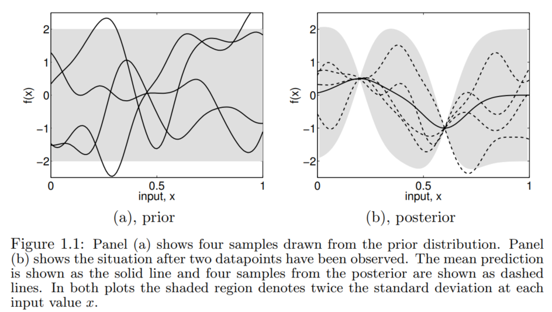

# Introduction
## Bayesian Modelling

Fig1.1(a) shows the prior is taken our to represent our beliefs over the kinds of functions we expected to observe before seeing any data. The functions are smooth and stationary (informally, the stationary means that the functions look similar at all $x$ locations.)
if their characteristic length-scale is too short which implicit that the function can vary fairly rapidly.

One issus with GPs prediction methods is that their basic complexity is $\mathcal{O}(n^3)$

# Regression
## Weight space view
### Standard linear model
$$
f(\mathbf{x})=\mathbf{x}^{\top} \mathbf{w}, \quad y=f(\mathbf{x})+\varepsilon
$$
$$
\varepsilon \sim \mathcal{N}\left(0, \sigma_n^2\right)
$$

the probability density of the nosie $\varepsilon$:

$$
p(x)=\frac{1}{\sigma \sqrt{2 \pi}} \exp \left(-\frac{(x-\mu)^2}{2 \sigma^2}\right)
$$
and the multiple Gaussian distribution:
$$
p\left(x_1, x_2, \ldots, x_n\right)=\prod_{i=1}^n p\left(x_i\right)=\frac{1}{(2 \pi)^{\frac{n}{2}} \sigma_1 \sigma_2 \ldots \sigma_n} \exp \left(-\frac{1}{2}\left[\frac{\left(x_1-\mu_1\right)^2}{\sigma_1^2}+\frac{\left(x_2-\mu_2\right)^2}{\sigma_3^2}+\ldots+\frac{\left(x_n-\mu_n\right)^2}{\sigma_n^2}\right]\right)
$$

$$
\begin{aligned}
p(\mathbf{y} \mid X, \mathbf{w}) & =\prod_{i=1}^n p\left(y_i \mid \mathbf{x}_i, \mathbf{w}\right)=\prod_{i=1}^n \frac{1}{\sqrt{2 \pi} \sigma_n} \exp \left(-\frac{\left(y_i-\mathbf{x}_i^{\top} \mathbf{w}\right)^2}{2 \sigma_n^2}\right) \\
& =\frac{1}{\left(2 \pi \sigma_n^2\right)^{n / 2}} \exp \left(-\frac{1}{2 \sigma_n^2}\left|\mathbf{y}-X^{\top} \mathbf{w}\right|^2\right)=\mathcal{N}\left(X^{\top} \mathbf{w}, \sigma_n^2 I\right)
\end{aligned}
$$

we need to specify a prior over the parameters, expressing our beliefs about the parameters before we look at the observations. We put on a zero mean Gaussian prior with covariance matrix $\Sigma_p $ on the weights.

$$
p(w \mid \mathcal{D})=\frac{p(\mathcal{D} \mid w) p(w)}{p(\mathcal{D})}
$$

$$
p(w \mid \mathcal{D}) \propto p(\mathcal{D} \mid w) p(w)
$$

$$
\text { posterior }=\frac{\text { likelihood } \times \text { prior }}{\text { marginal likelihood }}, \quad p(\mathbf{w} \mid \mathbf{y}, X)=\frac{p(\mathbf{y} \mid X, \mathbf{w}) p(\mathbf{w})}{p(\mathbf{y} \mid X)}
$$

Assumption: The $\textcolor{red}{w}$ and $\textcolor{red}{x}$ are independent, in other word, $\textcolor{red}{P(x,w) = P(x)P(w)}$

The $\propto$ is read "is proportional to". It means that:  $p(w \mid \mathcal{D})=k(\mathcal{D}) p(\mathcal{D} \mid w) p(w) \quad \forall w, \mathcal{D}$.

$$
\begin{aligned}
p(\mathbf{w} \mid X, \mathbf{y}) & \propto \exp \left(-\frac{1}{2 \sigma_n^2}\left(\mathbf{y}-X^{\top} \mathbf{w}\right)^{\top}\left(\mathbf{y}-X^{\top} \mathbf{w}\right)\right) \exp \left(-\frac{1}{2} \mathbf{w}^{\top} \Sigma_p^{-1} \mathbf{w}\right) \\
& \propto \exp \left(-\frac{1}{2}(\mathbf{w}-\overline{\mathbf{w}})^{\top}\left(\frac{1}{\sigma_n^2} X X^{\top}+\Sigma_p^{-1}\right)(\mathbf{w}-\overline{\mathbf{w}})\right)
\end{aligned}
$$

$$
\overline{\mathbf{w}}=\sigma_n^{-2}\left(\sigma_n^{-2} X X^{\top}+\Sigma_p^{-1}\right)^{-1} X \mathbf{y}
$$

$$
A=\sigma_n^{-2} X X^{\top}+\Sigma_p^{-1}
$$

$$
p(\mathbf{w} \mid X, \mathbf{y}) \sim \mathcal{N}\left(\overline{\mathbf{w}}=\frac{1}{\sigma_n^2} A^{-1} X \mathbf{y}, A^{-1}\right)
$$

## Function space view
GPs is a distribution over functions, and inference taking place directly in the space of functions.

