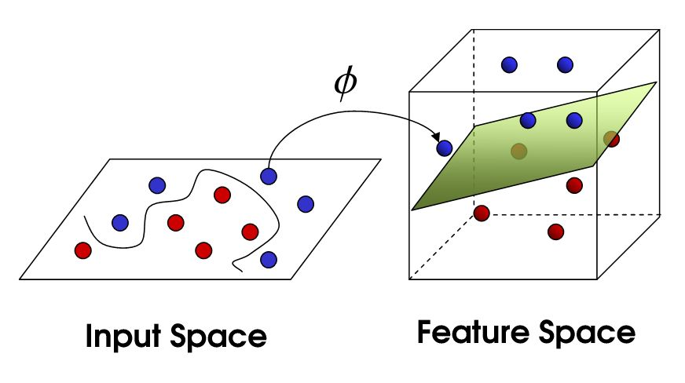

# 1. Introduction
## 1.1 Bayesian Modelling

Fig1.1(a) shows the prior is taken our to represent our beliefs over the kinds of functions we expected to observe before seeing any data. The functions are smooth and stationary (informally, the stationary means that the functions look similar at all $x$ locations.)
if their characteristic length-scale is too short which implicit that the function can vary fairly rapidly.

One issus with GPs prediction methods is that their basic complexity is $\mathcal{O}(n^3)$

# 2. Regression
## 2.1 Weight space view
### 2.1.1 Standard linear model
$$
f(\mathbf{x})=\mathbf{x}^{\top} \mathbf{w}, \quad y=f(\mathbf{x})+\varepsilon
$$
$$
\varepsilon \sim \mathcal{N}\left(0, \sigma_n^2\right)
$$

and the multiple Gaussian distribution:
$$
p\left(x_1, x_2, \ldots, x_n\right)=\prod_{i=1}^n p\left(x_i\right)=\frac{1}{(2 \pi)^{\frac{n}{2}} \sigma_1 \sigma_2 \ldots \sigma_n} \exp \left(-\frac{1}{2}\left[\frac{\left(x_1-\mu_1\right)^2}{\sigma_1^2}+\frac{\left(x_2-\mu_2\right)^2}{\sigma_3^2}+\ldots+\frac{\left(x_n-\mu_n\right)^2}{\sigma_n^2}\right]\right)
$$

$$
\begin{aligned}
p(\mathbf{y} \mid X, \mathbf{w}) & =\prod_{i=1}^n p\left(y_i \mid \mathbf{x}_i, \mathbf{w}\right)=\prod_{i=1}^n \frac{1}{\sqrt{2 \pi} \sigma_n} \exp \left(-\frac{\left(y_i-\mathbf{x}_i^{\top} \mathbf{w}\right)^2}{2 \sigma_n^2}\right) \\
& =\frac{1}{\left(2 \pi \sigma_n^2\right)^{n / 2}} \exp \left(-\frac{1}{2 \sigma_n^2}\left|\mathbf{y}-X^{\top} \mathbf{w}\right|^2\right)=\mathcal{N}\left(X^{\top} \mathbf{w}, \sigma_n^2 I\right)
\end{aligned}
$$

we need to specify a prior over the parameters, expressing our beliefs about the parameters before we look at the observations. We put on a zero mean Gaussian prior with covariance matrix $\Sigma_p $ on the weights.
$$
\mathbf{w} \sim \mathcal{N}\left(\mathbf{0}, \Sigma_p\right)
$$
$$
p(w \mid \mathcal{D})=\frac{p(\mathcal{D} \mid w) p(w)}{p(\mathcal{D})}
$$

$$
p(w \mid \mathcal{D}) \propto p(\mathcal{D} \mid w) p(w)
$$

$$
\text { posterior }=\frac{\text { likelihood } \times \text { prior }}{\text { marginal likelihood }}, \quad p(\mathbf{w} \mid \mathbf{y}, X)=\frac{p(\mathbf{y} \mid X, \mathbf{w}) p(\mathbf{w})}{p(\mathbf{y} \mid X)}
$$

Assumption: The $\textcolor{red}{w}$ and $\textcolor{red}{x}$ are independent, in other word, $\textcolor{red}{P(x,w) = P(x)P(w)}$

The $\propto$ is read "is proportional to". It means that:  $p(w \mid \mathcal{D})=k(\mathcal{D}) p(\mathcal{D} \mid w) p(w) \quad \forall w, \mathcal{D}$.

$$
\begin{aligned}
p(\mathbf{w} \mid X, \mathbf{y}) & \propto \exp \left(-\frac{1}{2 \sigma_n^2}\left(\mathbf{y}-X^{\top} \mathbf{w}\right)^{\top}\left(\mathbf{y}-X^{\top} \mathbf{w}\right)\right) \exp \left(-\frac{1}{2} \mathbf{w}^{\top} \Sigma_p^{-1} \mathbf{w}\right) \\
& \propto \exp \left(-\frac{1}{2}(\mathbf{w}-\overline{\mathbf{w}})^{\top}\left(\frac{1}{\sigma_n^2} X X^{\top}+\Sigma_p^{-1}\right)(\mathbf{w}-\overline{\mathbf{w}})\right)
\end{aligned}
$$

$$
\overline{\mathbf{w}}=\sigma_n^{-2}\left(\sigma_n^{-2} X X^{\top}+\Sigma_p^{-1}\right)^{-1} X \mathbf{y}
$$

$$
A=\sigma_n^{-2} X X^{\top}+\Sigma_p^{-1}
$$

$$
p(\mathbf{w} \mid X, \mathbf{y}) \sim \mathcal{N}\left(\overline{\mathbf{w}}=\frac{1}{\sigma_n^2} A^{-1} X \mathbf{y}, A^{-1}\right)
$$

To make predictions for a test case we average over all possible parameter values, weighted by their posterior probability. 
$\textcolor{red}{Just \ treat \ f_{*}=X_* \times w}$

$$
\begin{aligned}
p\left(f_* \mid \mathbf{x}_*, X, \mathbf{y}\right) & =\int p\left(f_* \mid \mathbf{x}_*, \mathbf{w}\right) p(\mathbf{w} \mid X, \mathbf{y}) d \mathbf{w} \\
& =\mathcal{N}\left(\frac{1}{\sigma_n^2} \mathbf{x}_*^{\top} A^{-1} X \mathbf{y}, \mathbf{x}_*^{\top} A^{-1} \mathbf{x}_*\right)
\end{aligned}
$$

$\textcolor{red}{Probability \ Density \ Function}$

$$
p(x)=\frac{1}{\sigma \sqrt{2 \pi}} \exp \left(-\frac{(x-\mu)^2}{2 \sigma^2}\right)
$$

Let $x$ be an $m$-dimensional multivariate normal random variable, then its probability density function is given by:
$$\sigma^2 \rightarrow \Sigma $$

$$
\begin{aligned}
p(\mathbf{x} \mid \boldsymbol{\mu}, \boldsymbol{\Sigma}) & =\mathcal{N}(\mathbf{x} \mid \boldsymbol{\mu}, \boldsymbol{\Sigma}) \\
& =(2 \pi)^{-m / 2}|\boldsymbol{\Sigma}|^{-1 / 2} \exp \left(-\frac{1}{2}(\mathbf{x}-\boldsymbol{\mu})^{\top} \boldsymbol{\Sigma}^{-1}(\mathbf{x}-\boldsymbol{\mu})\right)
\end{aligned}
$$

$\textcolor{red}{Product \ of \ two \ Gaussians}$

Let $\mathbf{x}$, a and $\mathbf{b}$ be of size $[m \times 1]$ and $\mathbf{A}$ and $\mathbf{B}$ be $[m \times m]$ covariance matrices. The product of two multivariate normal distributions is proportional to another multivariate normal distribution

$$
\mathcal{N}(\mathbf{x} \mid \mathbf{a}, \mathbf{A}) \mathcal{N}(\mathbf{x} \mid \mathbf{b}, \mathbf{B})=Z \mathcal{N}(\mathbf{x} \mid \mathbf{c}, \mathbf{C})
$$

with covariance and mean

$$
\mathbf{C}=\left(\mathbf{A}^{-1}+\mathbf{B}^{-1}\right)^{-1} \quad \text { and } \quad \mathbf{c}=\mathbf{C}\left(\mathbf{A}^{-1} \mathbf{a}+\mathbf{B}^{-1} \mathbf{b}\right)
$$

### 2.2 Projections of inputs to feature space

$$
f(\mathbf{x})=\phi(\mathbf{x})^{\top} \mathbf{w}
$$

$$
f_* \mid \mathbf{x}_*, X, \mathbf{y} \sim \mathcal{N}\left(\frac{1}{\sigma_n^2} \boldsymbol{\phi}\left(\mathbf{x}_*\right)^{\top} A^{-1} \Phi \mathbf{y}, \boldsymbol{\phi}\left(\mathbf{x}_*\right)^{\top} A^{-1} \boldsymbol{\phi}\left(\mathbf{x}_*\right)\right)
$$

## 2.3  Function space view
GPs is a distribution over functions, and inference taking place directly in the space of functions.
$$
\begin{aligned}
\mu(x) & =\mathbb{E}[f(x)] \\
k\left(x, x^{\prime}\right) & =\mathbb{E}\left[(f(x)-\mu(x))\left(f\left(x^{\prime}\right)-\mu\left(x^{\prime}\right)\right)\right]
\end{aligned}
$$

and will write the Gaussian process as 

$$
f(\mathbf{x}) \sim \mathcal{G} \mathcal{P}\left(m(\mathbf{x}), k\left(\mathbf{x}, \mathbf{x}^{\prime}\right)\right)
$$

For example, if $f(\mathbf{x})=\boldsymbol{\phi}(\mathbf{x})^{\top} \mathbf{w}$ with prior $\mathbf{w} \sim \mathcal{N}\left(\mathbf{0}, \Sigma_p\right)$

$$
\begin{aligned}
\mathbb{E}[f(\mathbf{x})] & =\phi(\mathbf{x})^{\top} \mathbb{E}[\mathbf{w}]=0 \\
\mathbb{E}\left[f(\mathbf{x}) f\left(\mathbf{x}^{\prime}\right)\right] & =\boldsymbol{\phi}(\mathbf{x})^{\top} \mathbb{E}\left[\mathbf{w} \mathbf{w}^{\top}\right] \phi\left(\mathbf{x}^{\prime}\right)=\phi(\mathbf{x})^{\top} \Sigma_p \boldsymbol{\phi}\left(\mathbf{x}^{\prime}\right)
\end{aligned}
$$

### A.2 Gaussian Identities
The multivariate Gaussian distribution has joint probability density given by

$$
p(\mathbf{x} \mid \mathbf{m}, \Sigma)=(2 \pi)^{-D / 2}|\Sigma|^{-1 / 2} \exp \left(-\frac{1}{2}(\mathbf{x}-\mathbf{m})^{\top} \Sigma^{-1}(\mathbf{x}-\mathbf{m})\right)
$$

let x and y be jointly Gaussian random vectors

$$
\left[\begin{array}{l}
\mathbf{x} \\
\mathbf{y}
\end{array}\right] \sim \mathcal{N}\left(\left[\begin{array}{l}
\boldsymbol{\mu}_x \\
\boldsymbol{\mu}_y
\end{array}\right],\left[\begin{array}{ll}
A & C \\
C^{\top} & B
\end{array}\right]\right)=\mathcal{N}\left(\left[\begin{array}{l}
\boldsymbol{\mu}_x \\
\boldsymbol{\mu}_y
\end{array}\right],\left[\begin{array}{ll}
\tilde{A} & \tilde{C} \\
\tilde{C}^{\top} & \tilde{B}
\end{array}\right]^{-1}\right)
$$

then the marginal distribution of x and conditional distribution of x given y are

$$
\begin{aligned}
\mathbf{x} \sim \mathcal{N}\left(\boldsymbol{\mu}_x, A\right), \text { and } \mathbf{x} \mid \mathbf{y} & \sim \mathcal{N}\left(\boldsymbol{\mu}_x+C B^{-1}\left(\mathbf{y}-\boldsymbol{\mu}_y\right), A-C B^{-1} C^{\top}\right) \\
\text { or } \mathbf{x} \mid \mathbf{y} & \sim \mathcal{N}\left(\boldsymbol{\mu}_x-\tilde{A}^{-1} \tilde{C}\left(\mathbf{y}-\boldsymbol{\mu}_y\right), \tilde{A}^{-1}\right)
\end{aligned}
$$

The covariance function specifies the covariance between pairs of random variables:
$$
\operatorname{cov}\left(f\left(\mathbf{x}_p\right), f\left(\mathbf{x}_q\right)\right)=k\left(\mathbf{x}_p, \mathbf{x}_q\right)=\exp \left(-\frac{1}{2}\left|\mathbf{x}_p-\mathbf{x}_q\right|^2\right)
$$

Note, that the covariance between the $\textcolor{red}{outputs}$ is written as a function of the $\textcolor{red}{inputs}$.

$\textcolor{red}{Reason}$:
The missing link is the orthogonal representation of the process. If you can write $f(x)=\sum_{i=1}^{\infty} Z_i h_i(x)$ where $Z_i$ are independent random variables with mean 0 and variance 1, and where $h_i$ are fixed basis functions, then defining the vector-values function $\phi(x)=\left(h_1(x), h_2(x), \ldots,\right)$, we have

$$
\begin{aligned}
& k(x, y)=\operatorname{Cov}(f(x), f(y)) \\
& =\sum_{i=1}^{\infty} \operatorname{Cov}\left(Z_i h_i(x), Z_i h_i(y)\right) \\
& =\sum_{i=1}^{\infty} h_i(x) h_i(y)=\langle\phi(x), \phi(y)\rangle
\end{aligned}
$$

## A.4 Cholesky Decomposition (Matrix square root)
The Cholesky Decomposition of a **symmetric, positive definite matrix A** decomposes A into a product of a lower triangular matrix L and its transpose

$$
L L^{\top}=A
$$

To generate samples $\mathbf{x} \sim \mathcal{N}(\mathbf{m}, K)$ with arbitrary mean $\mathbf{m}$ and covariance matrix $\mathbf{k}$ using a scalar Gaussian generator. 1. compute the Cholesky decomposition (aka, "matrix square root") $K=LL^T$, where L is a lower triangularmatrix. 2. Generate $u \sim \mathcal{N} (0,I)$, Compute $x = m + LU$, which has the desired distribution with mean $m$ and covariance $L \mathbb{E}\left[\mathbf{u} \mathbf{u}^{\top}\right] L^{\top}=L L^{\top}=K$ (by the independence of the elements of u).

### 2.3.1 Prediction with Noise-free Observations
$$
\left\{\left(\mathbf{x}_i, f_i\right) \mid i=1, \ldots, n\right\}
$$

$$
\left[\begin{array}{l}
\mathbf{f} \\
\mathbf{f}_*
\end{array}\right] \sim \mathcal{N}\left(\mathbf{0},\left[\begin{array}{ll}
K(X, X) & K\left(X, X_*\right) \\
K\left(X_*, X\right) & K\left(X_*, X_*\right)
\end{array}\right]\right)
$$

$$
\begin{aligned}
\mathbf{f}_* \mid X_*, X, \mathbf{f} \sim \mathcal{N}( & K\left(X_*, X\right) K(X, X)^{-1} \mathbf{f}, \\
& \left.K\left(X_*, X_*\right)-K\left(X_*, X\right) K(X, X)^{-1} K\left(X, X_*\right)\right) .
\end{aligned}
$$

### 2.3.2 Prediction using Noisy Observations
$$
\operatorname{cov}\left(y_p, y_q\right)=k\left(\mathbf{x}_p, \mathbf{x}_q\right)+\sigma_n^2 \delta_{p q} \text { or } \operatorname{cov}(\mathbf{y})=K(X, X)+\sigma_n^2 I,
$$

$$
\left[\begin{array}{c}
\mathbf{y} \\
\mathbf{f}_*
\end{array}\right] \sim \mathcal{N}\left(\mathbf{0},\left[\begin{array}{cc}
K(X, X)+\sigma_n^2 I & K\left(X, X_*\right) \\
K\left(X_*, X\right) & K\left(X_*, X_*\right)
\end{array}\right]\right)
$$

$$
\begin{aligned}
\mathbf{f}_* \mid X, \mathbf{y}, X_* & \sim \mathcal{N}\left(\overline{\mathbf{f}}_*, \operatorname{cov}\left(\mathbf{f}_*\right)\right), \text { where } \\
\overline{\mathbf{f}}_* & \triangleq \mathbb{E}\left[\mathbf{f}_* \mid X, \mathbf{y}, X_*\right]=K\left(X_*, X\right)\left[K(X, X)+\sigma_n^2 I\right]^{-1} \mathbf{y}, \\
\operatorname{cov}\left(\mathbf{f}_*\right) & =K\left(X_*, X_*\right)-K\left(X_*, X\right)\left[K(X, X)+\sigma_n^2 I\right]^{-1} K\left(X, X_*\right) .
\end{aligned}
$$

$$
\begin{aligned}
\bar{f}_* & =\mathbf{k}_*^{\top}\left(K+\sigma_n^2 I\right)^{-1} \mathbf{y}, \\
\mathbb{V}\left[f_*\right] & =k\left(\mathbf{x}_*, \mathbf{x}_*\right)-\mathbf{k}_*^{\top}\left(K+\sigma_n^2 I\right)^{-1} \mathbf{k}_* .
\end{aligned}
$$

Note that, the mean prediction is a linear combination of observations y;this is sometimes referred to as a $\textcolor{red}{linear \  predictor}$.

### 2.3.3 Marginal likelihood
$$
p(\mathbf{y} \mid X)=\int p(\mathbf{y} \mid \mathbf{f}, X) p(\mathbf{f} \mid X) d \mathbf{f}
$$

The term *marginal* liklihood refers to the marginalization over the function values **f**. Under the Gaussian process model the prior is Gaussian, $f|X \sim \mathcal{N}(0,K)$ or ,

$$
\log p(\mathbf{f} \mid X)=-\frac{1}{2} \mathbf{f}^{\top} K^{-1} \mathbf{f}-\frac{1}{2} \log |K|-\frac{n}{2} \log 2 \pi
$$

$$
\mathbf{y} \mid \mathbf{f} \sim \mathcal{N}\left(\mathbf{f}, \sigma_n^2 I\right)
$$

### A.7 A.8
The product of tow Gaussians gives another (un-normalized) Gaussian

$$
\begin{aligned}
\mathcal{N}(\mathbf{x} \mid \mathbf{a}, A) \mathcal{N}(\mathbf{x} \mid \mathbf{b}, B) & =Z^{-1} \mathcal{N}(\mathbf{x} \mid \mathbf{c}, C) \\
\text { where } \mathbf{c} & =C\left(A^{-1} \mathbf{a}+B^{-1} \mathbf{b}\right) \text { and } C=\left(A^{-1}+B^{-1}\right)^{-1}
\end{aligned}
$$

## 2.4. Decision Theory for Regression
Minimize the expected loss:
$$
\tilde{R}_{\mathcal{L}}\left(y_{\text {guess }} \mid \mathbf{x}_*\right)=\int \mathcal{L}\left(y_*, y_{\text {guess }}\right) p\left(y_* \mid \mathbf{x}_*, \mathcal{D}\right) d y_* .
$$

Thus out best guess, in the sense that it minimizes
the expected loss, is
$$
y_{\text {optimal }} \mid \mathbf{x}_*=\underset{y_{\text {guess }}}{\operatorname{argmin}} \tilde{R}_{\mathcal{L}}\left(y_{\text {guess }} \mid \mathbf{x}_*\right) .
$$

